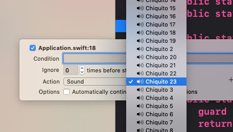
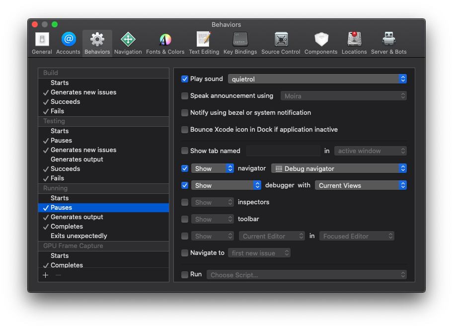

# Chiquito Breakpoints for Xcode

Sounds for Xcode breakpoints with voices by [Chiquito de la Calzada](https://en.wikipedia.org/wiki/Chiquito_de_la_Calzada).

## How to use

The easiest way to use these sounds is to add them to Xcode's breakpoint editor sound menu:

1. Download the sounds
2. Copy the audio files to `~/Library/Sounds`
3. Quit and relaunch Xcode

## "Quietorl" each time Xcode stops

One of the best ways to showcase these sounds is to add a "Quietorl" sound each time Xcode pauses execution (for instance when a Breakpoint is hit). To get that we just need to `Xcode > Behaviors > Edit Behaviors` and inside "Running > Pauses" add the quietorl sound.

## Credits

This project is highly inspired by the work of Alfonso Muñoz-Pomer Fuentes and César Gómez-Mora López who in 1995 released a mod for Doom with the voices of Chiquito.

This project actually uses this same set of sounds, this time for a different purpose.
